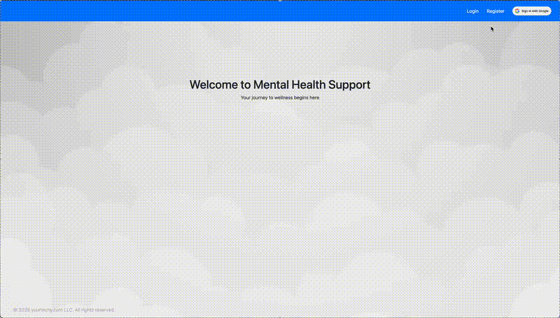
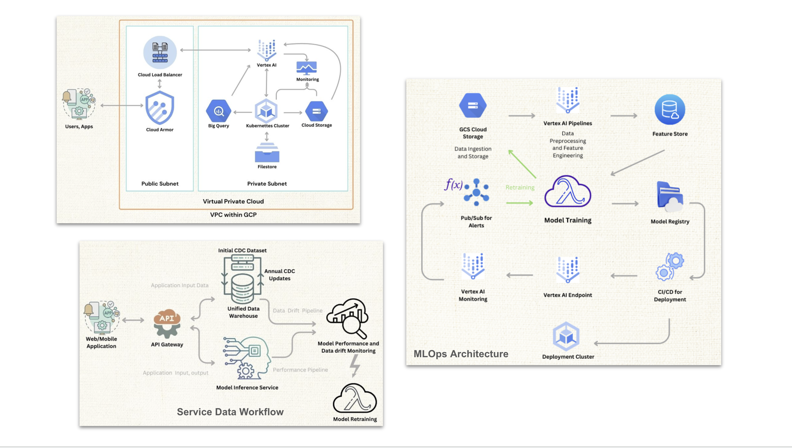
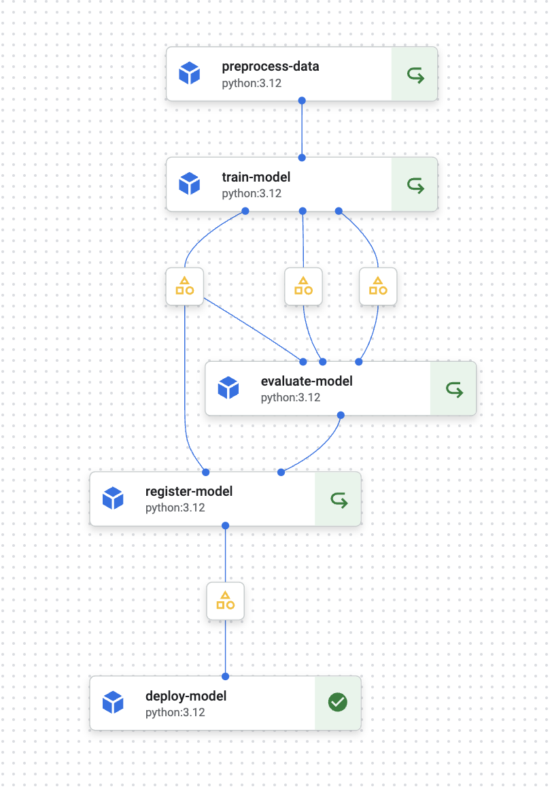

# ML Mental Health Modeling Pipeline with GCP Vertex AI (MLOps), Orchestrated with Terraform (IaC)

This project implements a **Machine Learning (ML) Mental Health Modeling Pipeline** on **Google Cloud Platform (GCP)** with **Vertex AI** for model development and deployment **(MLOps)**, and **Terraform** for infrastructure provisioning and management. 

The pipeline is fully automated - from setup to deployment, and operation - enabling **infrastructure-as-code (IaC)** practices for scalability and reproducibility.

---

## Table of Contents

- [Project Overview](#Overview)
- [Datascience Approach](#Datascience-Approach)
- [Model Development](#model-development)
- [MLOps Deployment](#MLops-Deployment)
- [Developer Prerequisites](#Developer-Prerequisites)
- [Project Structure](#Project-Structure)
- [Getting Started](#getting-started)
- [Contributing](#contributing)
- [License](#license)

---

## Overview

The project is designed to predict mental health conditions and can be repurposed for other domains like finance and customer analytics.

**Project Implementation:** The original machine learning pipeline and model development were implemented in [SpringBoard-DSC_Capstone_Project_3](https://github.com/judesantos/Springboard_DS_ML/tree/main/SpringBoard-DSC_Capstone_Project_3).
  
**Project Proposal:** Detailed project scope, objectives, and methodology are documented in the [Final Capstone Mental Health Prediction App Proposal](SpringBoard-DSC_Capstone_Project_3/Final_Capstone_Mental_Health_Prediction_App.pdf).
  
This repository extends the work from the Capstone Project by deploying and automating the end-to-end machine learning workflow using GCP services with Vertex AI, GKE, and Terraform for infrastructure automation.


Key Features:
- **Automated Infrastructure**: Terraform manages cloud resources dynamically.
- **Scalable ML Pipeline**: Vertex AI handles model training, evaluation, and deployment.
- **Continuous Learning**: Models are retrained automatically as new data becomes available.
- **Web Application**: A user-friendly interface for mental health predictions and insights.

The following is an overview of the infrastructure and model training pipeline.


### Application:

<p align="center">
  
</p>

  The Mental Health Support Application provides users with an interactive platform to assess, monitor, and receive guidance on mental well-being. The user interface is designed with simplicity   and accessibility in mind, ensuring a smooth experience for individuals seeking support.
  
  - User Authentication: Secure login and registration options.
  - Personalized Experience: Users can engage with resources tailored to their mental health needs.
  - Cloud-based Deployment: Hosted on a scalable cloud infrastructure for reliability and performance.
  - Interactive UI: Designed for ease of navigation and engagement.
  - Integration with AI Models: The Application in this setup - mental health application, uses XGBoost model.

 
### Architecure:

<p align="center">
  
</p>

  The cloud infrastructure is built on Google Cloud Platform (GCP), ensuring security, scalability, and maintainability. 
  The architecture is structured as follows:

  - Virtual Private Cloud (VPC): Segregates public and private resources for enhanced security.
  - Cloud Load Balancer & Cloud Armor: Ensures high availability and protects against threats.
  - BigQuery & Cloud Storage: Manages large-scale data ingestion and storage.
  - Kubernetes Cluster (GKE): Orchestrates containerized services efficiently.
  - Vertex AI Integration: Enables ML model training, monitoring, and deployment.
  - Filestore & Monitoring: Supports persistent storage and real-time observability.

  This setup enables seamless data flow from user interactions to model inference, ensuring a robust and scalable system.


### Vertex AI Model Deployment:

<p align="center">
  
</p>

  The MLOps pipeline automates data processing, model training, evaluation, and deployment using Vertex AI Pipelines. 
  The workflow consists of:
  
  - Preprocessing Data: Cleaning and transforming raw data into structured input for training.
  - Model Training: Using machine learning algorithms with optimized hyperparameters.
  - Model Evaluation: Assessing performance against validation datasets.
  - Model Registration: Storing trained models in the registry for version control.
  - Model Deployment: Deploying the best-performing model to a Vertex AI Endpoint for real-time predictions.
  - Monitoring & Retraining: Using data drift detection mechanisms to trigger retraining when necessary.
  
  This streamlined MLOps framework ensures continuous model improvement and reliable predictions.

### Current Implementation: Mental Health Prediction

Mental health issues are widespread and complex, yet timely and personalized support remains limited. This implementation focuses on predicting mental health conditions using ML models trained on large-scale mental health survey data. The system provides insights for early intervention, helping healthcare providers, policymakers, and individuals proactively address mental health needs.

### Key Beneficiaries:
- **Healthcare Providers**: Prioritize care, optimize resources, and improve patient outcomes.
- **Businesses & HR Teams**: Identify mental health risks among employees to enhance workplace well-being.
- **Policy & Government Agencies**: Use aggregated insights for public health planning and resource allocation.
- **Research & Academia**: Use the model framework for further analysis in mental health and beyond.

### Dataset & Data Pipeline

The ML pipeline is built on a continuously evolving dataset framework that integrates new and diverse data sources over time.

- **Current Dataset**: The model is trained on the **CDC’s Behavioral Risk Factor Surveillance System (BRFSS)**, offering insights into mental health trends across the United States.
- **Future Iterations**: The system is designed to incorporate additional data sources, including real-time survey data, anonymized user responses, and external research datasets.

---

## Datascience Approach

### Feature Engineering
- Key mental health indicators, lifestyle behaviors, and healthcare access patterns are extracted and transformed into meaningful features.
- Techniques include **categorizing complex responses**, combining related questions, and refining features for improved interpretability.

### Predictive Modeling
- **Classification algorithms** are employed to predict mental health outcomes.
- The pipeline begins with **logistic regression** as a baseline, followed by **neural networks, stacked models, and advanced classification techniques** to improve accuracy and robustness.

### Application Development
- A **web-based application** enables users to input predefined survey responses based on the model's most predictive features.
- The application provides **personalized insights** and **mental health recommendations**, ensuring accessibility on both desktop and mobile platforms.
- The application is maintained in a separate GitHub repository [ml_mentalhealth_app](https://github.com/judesantos/ml_mentalhealth_app.git) and is automatically deployed through a Terraform-based CI/CD pipeline whenever a new version is pushed to the repository. The application can also be redeployed as needed during the model deployment process to ensure alignment with the latest model updates.

---

## Model Development

  - The core machine learning algorithm used in this project is XGBoost (Extreme Gradient Boosting), a powerful and scalable implementation of gradient boosting designed for high performance.

  - **Why XGBoost?**
    XGBoost was selected for the Mental Health Prediction Model due to:
  
    - Speed & Scalability: Efficient parallelization and handling of large datasets.
    - Regularization: Built-in L1/L2 regularization prevents overfitting.
    - Feature Importance: Provides interpretable feature importance scores.
    - Handling Missing Data: Built-in support for sparse features.
    - Optimized Hyperparameters: Bayesian Optimization is used to fine-tune the model.

  - **Model Training Pipeline**
    The XGBoost model training process is fully automated in Vertex AI Pipelines and consists of the following key stages:
    - Preprocessing:
      - Converts categorical features into numerical representations.
      - Handles missing values using imputation techniques.
      - Scales numerical values for consistency.
    - Feature Selection:
      - Uses LASSO Regression to identify the most predictive features.
      - Removes low-importance features based on feature importance scores from XGBoost.
    - Model Training:
      - Trains an XGBoost Classifier with optimized hyperparameters.
      - Uses Bayesian Optimization to fine-tune max_depth, learning_rate, n_estimators, and min_child_weight.
    - Model Evaluation:
      - Calculates key metrics: Accuracy, Precision, Recall, F1-score, AUC-ROC.
      - Generates confusion matrices for better interpretability.
    - Model Registration:
      - Saves the trained XGBoost model into Vertex AI Model Registry for version control.
    - Model Deployment:
      - Deploys the best-performing model to Vertex AI Endpoints for real-time inference.

---

## MLOps Deployment

**Vertex AI Training Pipeline (XGBoost Integration)**

The XGBoost model is trained and deployed through Vertex AI Pipelines, structured as follows:

- Data Ingestion: Loads CDC data from BigQuery and performs ETL operations.
- Preprocessing & Feature Engineering: Uses Vertex AI Pipelines to clean and transform the dataset.
- Model Training: XGBoost is trained using hyperparameter tuning.
- Model Evaluation: The best model is selected based on validation metrics.
- Model Registration: The model is stored in Vertex AI Model Registry.
- Deployment: The model is deployed as an inference endpoint.
- Monitoring & Retraining:
  - Vertex AI monitors model performance in production.
  - Automated retraining is triggered when data drift is detected.
 
The deployment pipeline follows **MLOps best practices** to ensure:
- **Scalability & Reliability**: Cloud-based deployment on **Google Cloud Platform (GCP)** using **Vertex AI**.
- **Continuous Learning**: Automated monitoring, evaluation, and retraining of models to adapt to new data.
- **Infrastructure as Code (IaC)**: Terraform is used to **provision and manage** all cloud resources dynamically.

---

## Developer Prerequisites
*This project was developed on a **MacBook Pro M2** running macOS.*

### Developer Requirements

- **Basic understanding of computer networks**:
  - Network security (Firewalls, common vulnerabilities, and mitigation).
  - Network infrastructures (Load balancers, VPNs, subnetworks, IP blocks, IAM, etc.).
  - Network/cloud storage, databases, and cloud databases.
- **Experience with cloud services** (AWS, GCP, Azure, etc.):
  - Infrastructure setup and configuration.
  - Kubernetes and Docker: Configuration and deployment.
- **Terraform basics**: [Learn Terraform with HashiCorp](https://developer.hashicorp.com/terraform/tutorials)

### Developer Environment

Before deploying to a test environment, ensure the following:

1. **Google Cloud Platform**:
   - A GCP account with billing enabled.
   - Required IAM roles for Terraform:
     - `Owner` or `Editor` role.
     - `Storage Admin`, `Compute Admin`, `Vertex AI Admin` roles (depending on services used).

2. **Local Environment**:
   - Python => 3.12
   - Docker (Docker Desktop on MacOs)
   - Miniconda
   - Install [Terraform](https://www.terraform.io/downloads.html).
   - Install the [Google Cloud SDK](https://cloud.google.com/sdk/docs/install).
   - Authenticate to GCP using:
     ```bash
     # Terraform GCP access
     gcloud auth application-default login
     # gcloud CLI commands
     gcloud auth login
     ```

3. **Configuration**:
   - Set the GCP project ID:
     ```bash
     gcloud config set project [PROJECT_ID]
     ```
   - Create a service account key file with the required permissions and download it as `credentials.json`.

4. **Access to the Mental Health Application GitHub Repo**:
   - [ML Mental Health](https://github.com/judesantos/ml_mentalhealth_app) Application Repository
   - Add Cloud Build app to your GitHub account. [See Google Cloud Documentation](https://cloud.google.com/build/docs/automating-builds/github/connect-repo-github).
   - Create a Personal Access Token from your GitHub account.

5. **Terraform Backend**:
   - Ensure a GCS bucket exists for storing the Terraform state.

---

## Project Structure
```
├── .env.development                  # Environment variables for development
├── .gitignore
├── README.md
├── cloud_functions                   # Serverless functions for MLOps automation
│   ├── retraining_notification       # Alerts when retraining is triggered
│   │   ├── main.py
│   │   └── requirements.txt
│   ├── trigger_pipeline              # Starts the ML pipeline on Vertex AI
│   │   ├── main.py                   # Trigger function
│   │   ├── requirements.txt          # Required packages
│   └── vertex_ai_notification        # Handles notifications for Vertex AI events
│       ├── main.py                   # Notification function
│       └── requirements.txt          # Required packages
├── data
│   └── llcp_2022_2023_cleaned.csv    # Base dataset for training and inference
├── docker
│   └── vertexai-middleware           # Dockerfile and scripts for Vertex AI middleware (custom container)
│       ├── Dockerfile                # Dockerfile for the middleware and application startup
│       ├── build.sh                  # Build script for the Docker image
│       ├── ml_inference_data.py      # Data preprocessing script
│       └── predictor.py              # Router for the application implements /predict
├── environment.yml                   # Python environment packages required for this project
├── images
│   ├── dataflow.png
│   ├── mlops.png
│   └── platform.png
├── pipelines                         # Vertex AI pipeline definition
│   ├── components
│   │   ├── deploy.py                 # Component for model deployment
│   │   ├── evaluate.py               # Component for model evaluation
│   │   ├── preprocess.py             # Component for data preprocessing
│   │   ├── register.py               # Component for model registration
│   │   └── train.py                  # Component for model training
│   ├── pipeline.py                   # Pipeline - Defines the workflow
│   └── trigger_pipeline.py           # Manually trigger the pipeline (for testing)
└── terraform                         # Terraform configuration for GCP resources
    ├── app.tf                        # MLops application deployment
    ├── database.tf                   # Database setup
    ├── gcr.tf                        # Artifact (GCR) Registry setup
    ├── gcs.tf                        # GCS bucket setup
    ├── gke.tf                        # GKE cluster setup
    ├── iam.tf                        # IAM roles and permissions
    ├── kubernetes.tf                 # (GKE) Kubernetes resources
    ├── networking.tf                 # Networking setup
    ├── output.tf                     # Outputs from Terraform
    ├── provider.tf                   # Provider configuration
    ├── sa.tf                         # Service accounts
    ├── setup.tf                      # Setup scripts (Docker build, data upload, pipeline trigger)
    ├── terraform.tfvars.development  # Development environment variables
    ├── variables.tf                  # Variable declarations
    ├── versions.tf                   # Provider versions
    └── vertex_ai.tf                  # Vertex AI resources
```
---

## Getting Started

Follow these steps to deploy the infrastructure:

### 1. Clone the Repository and Set Up Python Environment
Clone the repository and set up the Python environment:
```bash
git clone https://github.com/judesantos/ml_mentalhealth_gcp
cd ml_mentalhealth_gcp

# Create and activate the Python environment
conda env create -f environment.yml
conda activate ml_gcp
```

### 2. Set Up Terraform Variables
Create a `terraform.tfvars` file to specify your variables (replace placeholders with actual values):
* See [terraform.tfvars.development](./terraform/terraform.tfvars.development)
```bash
project_id = "gcp-project-id"
region     = "region"
...
```

### 3. Initialize Terraform
Initialize Terraform to download the required provider plugins and set up the backend:
```bash
cd terraform

terraform init
```

### 4. Plan the Deployment
Generate and review the execution plan to verify the resources that will be created:
```bash
terraform plan
```

### 5. Apply the Deployment
Deploy the resources on GCP:
```bash
terraform apply
```
Confirm the prompt with `yes` to proceed.

### 6. Verify Deployment
Once the deployment completes:
- Check the GCP Console to verify the resources.
- Ensure all services are running as expected.

### 7. Retrieve Outputs
Retrieve the Terraform outputs to generate a report:
```bash
terraform output -json > pipeline_report.json
```

### 8. Clean Up (Optional)
To tear down the deployed infrastructure:
```bash
terraform destroy
```
Go to cloud console and delete/disable resources and services if not so:
- Cloud SQL             # Application Authentication
- BigQuery              # Vertex AI Feature Store
- VPC Network           # VPC
- Vertex AI             # Feature store, Model Registry, Pipelines
- GCS                   # Cloud Buckets
- GKE                   # Kubernetes Cluster
- Artifacts Registry    # Atifact Registry (AKA: GCR)

---

## Notes

### Troubleshooting
- If Terraform fails to authenticate, verify your GCP credentials:
  ```bash
  gcloud auth application-default login
  ```
- Ensure the service account has the necessary permissions.
- Check logs for specific errors using:
  ```bash
  terraform show
  ```

### Create/Update Docker Container Images
- **MLOps App**:
  ```bash
  terraform apply -replace="null_resource.mlops_app_docker_build"
  ```
- **Vertex AI Model Endpoint Custom Container**:
  ```bash
  terraform apply -replace="null_resource.vertexai_endpoint_middleware"
  ```

---

## Contributing
Contributions are welcome! Please follow these steps:

Fork the repository.
Create a new branch (feature/your-feature).
Commit your changes.
Push to the branch.
Open a Pull Request.

---

## License
This project is licensed under the MIT License. See the [LICENSE](./LICENSE) file for details.


