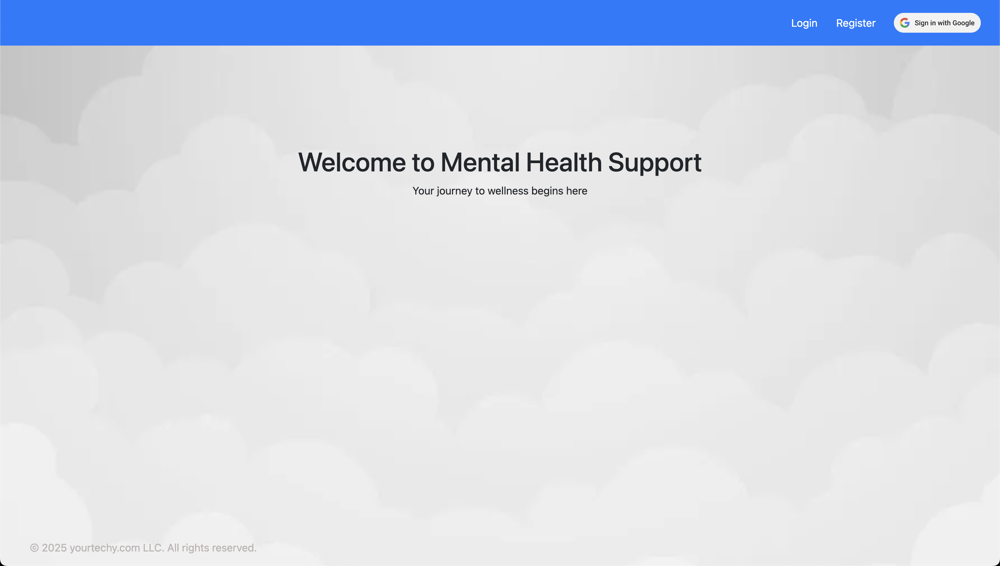

# ML Mental Health Modeling Pipeline on GCP Vertex AI Orchestrated with Terraform

This project implements a **Machine Learning (ML) Mental Health Modeling Pipeline** on **Google Cloud Platform (GCP)**, leveraging **Vertex AI** for model development and deployment, and **Terraform** for infrastructure provisioning and management. The pipeline is fully automated, enabling infrastructure-as-code (IaC) practices for scalability and reproducibility.

---

### Application

<p align="center">
  
</p>
<p align="center">
  
</p>

---

## Architecture

The system integrates **Mental Health Support Services**, **Cloud Platform**, and **MLOps Infrastructure** for seamless scalability and integration. Below are the architecture diagrams:

### 1. Platform Architecture

<p align="center">
  
</p>

### 2. Service Dataflow Diagram
<p align="center">
  
</p>

### 3. MLOps Architecture
<p align="center">
  
</p>

---

## Overview

This project provides a **scalable and adaptable ML pipeline** designed for predictive modeling across various domains. By integrating **GCP**, **Vertex AI**, and **Terraform**, the system automates model development, deployment, and continuous retraining. While the current implementation focuses on **mental health prediction**, the framework is extensible to other predictive analytics use cases, such as finance, customer behavior analysis, and more.

### Key Features:
- **Automated Infrastructure**: Terraform manages cloud resources dynamically.
- **Scalable ML Pipeline**: Vertex AI handles model training, evaluation, and deployment.
- **Continuous Learning**: Models are retrained automatically as new data becomes available.
- **Web Application**: A user-friendly interface for mental health predictions and insights.

---

## Current Implementation: Mental Health Prediction

Mental health issues are widespread and complex, yet timely and personalized support remains limited. This implementation focuses on predicting mental health conditions using ML models trained on large-scale mental health survey data. The system provides insights for early intervention, helping healthcare providers, policymakers, and individuals proactively address mental health needs.

### Key Beneficiaries:
- **Healthcare Providers**: Prioritize care, optimize resources, and improve patient outcomes.
- **Businesses & HR Teams**: Identify mental health risks among employees to enhance workplace well-being.
- **Policy & Government Agencies**: Use aggregated insights for public health planning and resource allocation.
- **Research & Academia**: Leverage the model framework for further analysis in mental health and beyond.

---

## Dataset & Data Pipeline

The ML pipeline is built on a continuously evolving dataset framework that integrates new and diverse data sources over time.

- **Current Dataset**: The model is trained on the **CDC’s Behavioral Risk Factor Surveillance System (BRFSS)**, offering insights into mental health trends across the United States.
- **Future Iterations**: The system is designed to incorporate additional data sources, including real-time survey data, anonymized user responses, and external research datasets.

---

## Data Science Approach

### Feature Engineering
- Key mental health indicators, lifestyle behaviors, and healthcare access patterns are extracted and transformed into meaningful features.
- Techniques include **categorizing complex responses**, combining related questions, and refining features for improved interpretability.

### Predictive Modeling
- **Classification algorithms** are employed to predict mental health outcomes.
- The pipeline begins with **logistic regression** as a baseline, followed by **neural networks, stacked models, and advanced classification techniques** to improve accuracy and robustness.

### Application Development
- A **web-based application** enables users to input predefined survey responses based on the model's most predictive features.
- The app provides **personalized insights** and **mental health recommendations**, ensuring accessibility on both desktop and mobile platforms.

---

## MLOps & Deployment

The deployment pipeline follows **MLOps best practices** to ensure:
- **Scalability & Reliability**: Cloud-based deployment on **Google Cloud Platform (GCP)** using **Vertex AI**.
- **Continuous Learning**: Automated monitoring, evaluation, and retraining of models to adapt to new data.
- **Infrastructure as Code (IaC)**: Terraform is used to **provision and manage** all cloud resources dynamically.

---

## Prerequisites

### Developer Requirements
- **Basic understanding of computer networks**:
  - Network security (Firewalls, common vulnerabilities, and mitigation).
  - Network infrastructures (Load balancers, VPNs, subnetworks, IP blocks, IAM, etc.).
  - Network/cloud storage, databases, and cloud databases.
- **Experience with cloud services** (AWS, GCP, Azure, etc.):
  - Infrastructure setup and configuration.
  - Kubernetes and Docker: Configuration and deployment.
- **Terraform basics**: Configuration and troubleshooting.

### Developer Environment
**Note**: This project was developed on a **MacBook Pro M2** running macOS.

Before deploying, ensure the following:

1. **Google Cloud Platform**:
   - A GCP account with billing enabled.
   - Required IAM roles for Terraform:
     - `Owner` or `Editor` role.
     - `Storage Admin`, `Compute Admin`, `Vertex AI Admin` roles (depending on services used).

2. **Local Environment**:
   - Python => 3.12
   - Docker (Docker Desktop on MacOs)
   - Miniconda
   - Install [Terraform](https://www.terraform.io/downloads.html).
   - Install the [Google Cloud SDK](https://cloud.google.com/sdk/docs/install).
   - Authenticate to GCP using:
     ```bash
     # Terraform GCP access
     gcloud auth application-default login
     # gcloud CLI commands
     gcloud auth login
     ```

3. **Configuration**:
   - Set the GCP project ID:
     ```bash
     gcloud config set project [PROJECT_ID]
     ```
   - Create a service account key file with the required permissions and download it as `credentials.json`.

4. **Access to the Mental Health Application GitHub Repo**:
   - [ML Mental Health App Repo](https://github.com/judesantos/ml_mentalhealth_app)
   - Add Cloud Build app to your GitHub account. [See Google Cloud Documentation](https://cloud.google.com/build/docs/automating-builds/github/connect-repo-github).
   - Create a Personal Access Token from your GitHub account.

5. **Terraform Backend**:
   - Ensure a GCS bucket exists for storing the Terraform state.

---

## Deployment Steps

Follow these steps to deploy the infrastructure:

### 1. Clone the Repository and Set Up Python Environment
Clone the repository and set up the Python environment:
```bash
git clone https://github.com/judesantos/ml_mentalhealth_gcp
cd ml_mentalhealth_gcp

# Create and activate the Python environment
conda env create -f environment.yml
conda activate ml_gcp
```

### 2. Set Up Terraform Variables
Create a `terraform.tfvars` file to specify your variables (replace placeholders with actual values):
```bash
project_id = "gcp-project-id"
region     = "region"
...
```

### 3. Initialize Terraform
Initialize Terraform to download the required provider plugins and set up the backend:
```bash
cd terraform

terraform init
```

### 4. Plan the Deployment
Generate and review the execution plan to verify the resources that will be created:
```bash
terraform plan
```

### 5. Apply the Deployment
Deploy the resources on GCP:
```bash
terraform apply
```
Confirm the prompt with `yes` to proceed.

### 6. Verify Deployment
Once the deployment completes:
- Check the GCP Console to verify the resources.
- Ensure all services are running as expected.

### 7. Retrieve Outputs
Retrieve the Terraform outputs to generate a report:
```bash
terraform output -json > pipeline_report.json
```

### 8. Clean Up (Optional)
To tear down the deployed infrastructure:
```bash
terraform destroy
```

---

## Project Structure
```

├── .env.development                  # Environment variables for development
├── .gitignore
├── README.md
├── cloud_functions                   # Google Cloud Functions for MLOps
│   ├── retraining_notification
│   │   ├── main.py
│   │   └── requirements.txt
│   ├── trigger_pipeline              # Cloud Function to trigger Vertex AI pipeline
│   │   ├── main.py                   # Trigger function
│   │   ├── requirements.txt          # Required packages
│   └── vertex_ai_notification        # Cloud Function for Vertex AI notifications
│       ├── main.py                   # Notification function
│       └── requirements.txt          # Required packages
├── data
│   └── llcp_2022_2023_cleaned.csv    # Base dataset for training and inference
├── docker
│   └── vertexai-middleware           # Dockerfile and scripts for Vertex AI middleware (custom container)
│       ├── Dockerfile                # Dockerfile for the middleware and application startup
│       ├── build.sh                  # Build script for the Docker image
│       ├── ml_inference_data.py      # Data preprocessing script
│       └── predictor.py              # Router for the application implements /predict
├── environment.yml                   # Python environment packages required for this project
├── images
│   ├── dataflow.png
│   ├── mlops.png
│   └── platform.png
├── pipelines                         # Vertex AI pipeline definition
│   ├── components
│   │   ├── deploy.py                 # Component for model deployment
│   │   ├── evaluate.py               # Component for model evaluation
│   │   ├── preprocess.py             # Component for data preprocessing
│   │   ├── register.py               # Component for model registration
│   │   └── train.py                  # Component for model training
│   ├── pipeline.py                   # Pipeline - Defines the workflow
│   └── trigger_pipeline.py           # Manually trigger the pipeline (for testing)
└── terraform                         # Terraform configuration for GCP resources
    ├── app.tf                        # MLops application deployment
    ├── database.tf                   # Database setup
    ├── gcr.tf                        # Artifact (GCR) Registry setup
    ├── gcs.tf                        # GCS bucket setup
    ├── gke.tf                        # GKE cluster setup
    ├── iam.tf                        # IAM roles and permissions
    ├── kubernetes.tf                 # (GKE) Kubernetes resources
    ├── networking.tf                 # Networking setup
    ├── output.tf                     # Outputs from Terraform
    ├── provider.tf                   # Provider configuration
    ├── sa.tf                         # Service accounts
    ├── setup.tf                      # Setup scripts (Docker build, data upload, pipeline trigger)
    ├── terraform.tfvars.development  # Development environment variables
    ├── variables.tf                  # Variable declarations
    ├── versions.tf                   # Provider versions
    └── vertex_ai.tf                  # Vertex AI resources
```

---

## Notes

### Troubleshooting
- If Terraform fails to authenticate, verify your GCP credentials:
  ```bash
  gcloud auth application-default login
  ```
- Ensure the service account has the necessary permissions.
- Check logs for specific errors using:
  ```bash
  terraform show
  ```

### Create/Update Docker Container Images
- **MLOps App**:
  ```bash
  terraform apply -replace="null_resource.mlops_app_docker_build"
  ```
- **Vertex AI Model Endpoint Custom Container**:
  ```bash
  terraform apply -replace="null_resource.vertexai_endpoint_middleware"
  ```

---
